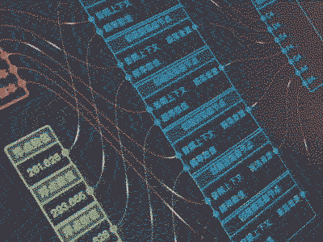

## Airglass.js NodeLink Demo 开发笔记

* [Airglass.js开发笔记：处理端口逻辑](https://www.shuaihuajun.com/article/airglass-node-port-processor/)
* [airglass开发笔记：节点端口连通与断连](https://www.shuaihuajun.com/article/airglass-module-build-connection/)
* [airglass.js最佳实践：创建模块连线](https://www.shuaihuajun.com/article/airglass-create-module-line/)
* [Airglass.js开发笔记：可视化模块连接](https://www.shuaihuajun.com/article/airglass-module-relationship-visualization/)